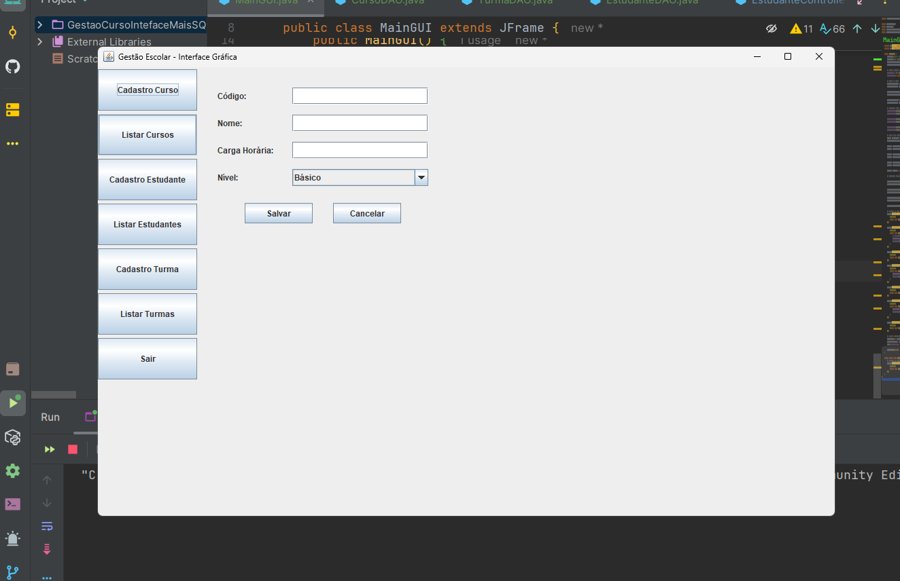
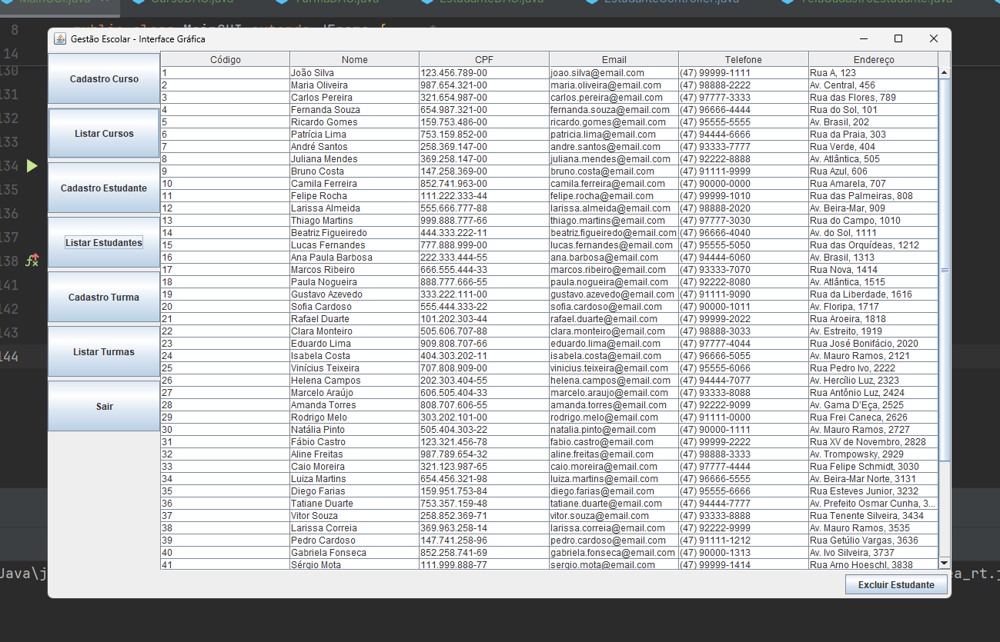

# 🎓 **Sistema de Gestão Escolar – Java Swing & PostgreSQL**

## 📌 **Visão Geral**

O **Sistema de Gestão Escolar** é uma aplicação Java desenvolvida com **Swing** para interface gráfica e **PostgreSQL** para persistência de dados.
Foi estruturado utilizando **arquitetura MVC** e **DAO Pattern**, garantindo organização, escalabilidade e facilidade de manutenção.

Com ele, é possível **cadastrar, listar e gerenciar** cursos e turmas de forma intuitiva, com **formulários interativos** e **campos validados**.

Este projeto foi desenvolvido com foco em **boas práticas profissionais** e organização de código para fácil manutenção e expansão futura.

---

## 🖥 **Interface Gráfica**

A interface foi desenvolvida com **Java Swing**, oferecendo um ambiente visual amigável para o usuário final.
Os formulários contam com campos de entrada, menus suspensos, botões de ação e mensagens de confirmação/erro.

| Tela de Cadastro Curso                                                     


|  |


| Tela de Cadastro de Turma 


| 


| Tela de Listar Estudante 


|  

---

## ⚙ **Principais Funcionalidades**

* 📚 **Cadastro e listagem de cursos**
* 🏫 **Cadastro de turmas** (com data de início, data de fim e período)
* 🎯 **Associação de turmas a cursos**
* 📅 **Seleção de período via `enum`**
* 💾 **Integração com PostgreSQL**
* 🖥 **Interface gráfica amigável com Swing**
* ✅ **Validação de dados antes do envio**

---

## 🛠 **Tecnologias Utilizadas**

* **Java SE 17+**
* **Swing** (Interface gráfica)
* **PostgreSQL** (Banco de dados)
* **JDBC** (Conexão com banco)
* **Arquitetura MVC**
* **DAO Pattern**

---

## 📜 **Trecho de Código – Inserção com ENUM e Recuperação de ID**

Um dos pontos mais complexos do projeto foi integrar corretamente **tipos ENUM do PostgreSQL** com o Java usando JDBC.
No banco de dados, o campo `periodo` foi definido como:

```sql
CREATE TYPE periodo_enum AS ENUM ('MATUTINO', 'VESPERTINO', 'NOTURNO');
```

Para realizar a inserção, foi necessário converter o valor para o tipo ENUM do PostgreSQL, utilizando a sintaxe:

```java
String sql = """
    INSERT INTO turma (codigo, curso_id, data_inicio, data_fim, periodo) 
    VALUES (?, ?, ?, ?, ?::periodo_enum)
""";
```

O **desafio técnico** é que a biblioteca JDBC atual não oferece suporte direto para conversão automática de `enum` Java para `enum` do PostgreSQL.
Foi preciso **mapear manualmente** o valor no `PreparedStatement`, garantindo que a string enviada correspondesse exatamente ao valor do ENUM no banco.

---

## ⚠ **Desafio Adicional – Uso de `RETURNING` no JDBC**

Outra dificuldade surgiu ao tentar obter o **ID gerado** logo após uma inserção.
No PostgreSQL, podemos usar:

```sql
INSERT INTO estudante (nome, cpf, email, telefone, endereco, curso_codigo) 
VALUES (?, ?, ?, ?, ?, ?) 
RETURNING codigo;
```

No Java, o código para tratar essa resposta foi:

```java
try (PreparedStatement stmt = conn.prepareStatement(sql)) {
    stmt.setString(1, estudante.getNome());
    stmt.setString(2, estudante.getCpf());
    stmt.setString(3, estudante.getEmail());
    stmt.setString(4, estudante.getTelefone());
    stmt.setString(5, estudante.getEndereco());
    stmt.setString(6, estudante.getCurso().getCodigo());

    try (ResultSet rs = stmt.executeQuery()) {
        if (rs.next()) {
            estudante.setCodigo(rs.getInt("codigo"));
        } else {
            throw new SQLException("Falha ao obter o código do estudante inserido.");
        }
    }
}
```

📌 **Por que isso foi difícil?**

* O **JDBC padrão** tem suporte limitado para `RETURNING` em PostgreSQL.
* Foi preciso utilizar `executeQuery()` em vez de `executeUpdate()` para capturar o retorno.
* Alguns drivers JDBC mais antigos **não suportam** corretamente essa funcionalidade, causando erros como *"No results were returned by the query"* se mal implementado.
* É necessário garantir que a versão do **driver JDBC para PostgreSQL** esteja **atualizada** para evitar incompatibilidades.

---

## 🚀 **Como Executar**

1. **Clonar o repositório**

   ```bash
   git clone https://github.com/seu-usuario/gestao-escolar-java.git
   ```
2. **Abrir no IntelliJ IDEA** (ou Eclipse/NetBeans)
3. **Configurar o banco de dados**

   * Criar um banco PostgreSQL com nome `sistema_gestao_escolar`
   * Executar o script SQL de criação das tabelas (pasta `/sql`)
   * Ajustar as credenciais no arquivo `ConnectionFactory.java`
4. **Executar a aplicação**

   * Rodar a classe `MainGUI`

---

## 📂 **Estrutura do Projeto**

```
gestao-escolar-java/
│
├── src/br/com/escola/gestaoescolar/
│   ├── model/        # Entidades do sistema
│   ├── view/         # Telas e interface gráfica
│   ├── controller/   # Lógica de controle
│   ├── dao/          # Acesso ao banco de dados
│
├── docs/             # Imagens do projeto
├── sql/              # Scripts de criação de tabelas
└── README.md         # Documentação do projeto
```

---

## 👨‍💻 **Autor**

**Pedro Paulo Damasceno Muniz**
Estudante de Análise e Desenvolvimento de Sistemas – Uniasselvi – Blumenau
Participante do treinamento intensivo +Devs2Blu – Blumenau
📌 **GitHub:** [Damasceno11](https://github.com/Damasceno11)
📌 **LinkedIn:** [Pedro Paulo Damasceno Muniz](https://www.linkedin.com/in/pedro-paulo-damasceno-muniz)

---
